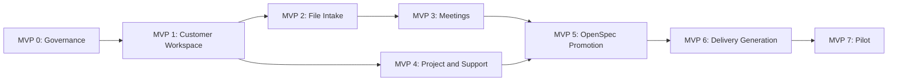

# BCProjectOS MVP Roadmap

Status: Active; MVP 0 contract accepted; POV-001 decision Reduce; MVP 1 authorized, not started
Date: 2026-07-11

## Product Goal

BCProjectOS is a reusable, local-first customer workspace for recurring Business Central work. It connects company knowledge, BC process knowledge, external files, meetings, projects, budgets, support cases, governed changes, and generated delivery artifacts without replacing specialist systems such as Business Central, Jira, Confluence, SharePoint, or accounting software.

## Lean Product Decisions

- One reusable blueprint, instantiated once per customer.
- One OpenSpec root per customer workspace initially.
- Projects, support cases, meetings, files, and changes use stable IDs and relations instead of duplicate copies.
- Support cases become OpenSpec changes only when behavior, code, configuration, UAT, or release governance changes.
- External originals remain immutable and receive hashes, metadata, classification, and archive records.
- AI-generated classifications, meeting records, decisions, and tickets remain drafts until reviewed.
- Version 1 starts with Sales, Purchasing, Inventory, and Finance.
- All outputs remain local; no external publishing is part of the MVP roadmap.
- BCProjectOS owns canonical state; Project Twin is a later read-only visualization layer.
- A 2-4 day Proof of Value must pass before MVP 0 begins.

## Proof of Value Gate

Before Cluster A, execute the limited workflow in `notes/bc-project-os-proof-of-value.md`.

The Proof of Value covers one customer workspace, five external files, one transcript, one support case, one project/budget update, and one promoted OpenSpec change. It produces an explicit Go, Reduce, Reframe, or Stop decision.

POV-001 has been executed locally with synthetic data. The user explicitly approved `Reduce` on 2026-07-11. The product-value gate is resolved and MVP 1 may begin only in the reduced scope; this does not authorize later MVPs or platform work.

Do not interpret the PoV decision as approval for the complete roadmap merely because the existing technical spike works. Continue through the individual MVP gates only while practical value outweighs metadata and review overhead.

## Current Baseline

The existing `examples/bc-enterprise-blueprint/` is a technical spike. It already proves:

- a lean OpenSpec core with six artifacts;
- local Epic, Story, Task, UAT, documentation, training, Confluence-style, and release generation;
- source and evidence hashes;
- Planning, BuildReady, and ReleaseReady gates;
- a project-local `$bc-delivery` skill.

This spike will be reused in MVP 5 and MVP 6. It is not yet the complete BCProjectOS customer workspace.

## MVP Clusters

### Cluster A: Foundation

#### MVP 0 - Product Contract and Governance

Status: Completed locally on 2026-07-11 by explicit authorization. The accepted contract is in this repository and is verified by `automation/Test-ProductContract.ps1`. Contract release `0.0.1` is not published. No Proof-of-Value outcome is claimed by this status change.

Purpose: Freeze the smallest coherent BCProjectOS model before adding more automation.

Scope:

- canonical entities and IDs for customer, project, support case, meeting, external file, knowledge item, ticket, requirement, evidence, and change;
- source-of-truth and generated-content boundaries;
- lifecycle states and approval rules;
- initial tag dimensions and document types;
- data protection, customer isolation, backup, retention, and large-file policy;
- blueprint version and upgrade policy.

Acceptance:

- every entity has one canonical storage location;
- tags, relations, statuses, and IDs have distinct purposes;
- generated content is never mistaken for approval or evidence;
- no unresolved architecture decision blocks MVP 1.

Accepted decisions:

- one physically isolated repository and workspace root per customer;
- one OpenSpec root per customer workspace;
- canonical file-based entities with immutable prefixed ULIDs and typed ID relations;
- strict separation of immutable originals, curated knowledge, Evidence, work records, and generated outputs;
- controlled document types, four tag dimensions, and separate lifecycle, review, approval, work, intake, and change status axes;
- SHA-256 content-addressed originals outside Git, fail-closed unknown-file handling, and no cross-customer blob store;
- manifest-based backup/restore contract, customer-specific retention, two-step deletion, and legal-hold protection;
- Semantic Versioning plus explicit idempotent workspace migrations;
- promotion to OpenSpec only for governed behavioral or delivery changes;
- no external writes, synchronization, live BC access, or Delivery-Spike integration in MVP 0.

MVP 1 architecture readiness is recorded in `contract/mvp1-readiness.md`. Operational RPO/RTO values, customer-specific retention periods, approval-role assignments, and storage targets remain per-workspace configuration. The roadmap's Proof-of-Value gate remains a separate product-value gate and is not silently treated as passed.

Estimate: 2-3 person-days.

#### MVP 1 - Blank Customer Workspace and BC Baseline

Status: Authorized in reduced scope; not started.

Purpose: Create a customer workspace that supports implementation, enhancement, and support-only profiles.

Scope:

- blank customer workspace generator;
- company and organization profile;
- rudimentary Sales, Purchasing, Inventory, and Finance knowledge structure;
- application landscape, extensions, integrations, roles, and environments;
- project, support-only, and mixed workspace profiles;
- sample data only, without real tenant or customer identifiers.

Acceptance:

- a new customer workspace can be created with one command;
- unused profiles stay empty without creating ceremony;
- the four BC areas are navigable and consistently structured;
- the workspace records its blueprint version.

Estimate: 3-5 person-days.

Release: `0.1 - Blank Customer Workspace`.

### Cluster B: Knowledge Intake

#### MVP 2 - External File Inbox, Classification, and Archive

Purpose: Turn an uncontrolled drop folder into traceable source material.

Scope:

- `external-files/inbox`, `review`, `quarantine`, `derived`, `register`, and `archive`;
- recurring inbox scan;
- immutable original, SHA-256 hash, duplicate detection, type detection, and processing log;
- controlled first document types: documentation, evidence, test-file, transcript, and unknown;
- initial tag dimensions: BC area, knowledge role, work context, lifecycle, and sensitivity;
- confidence-based routing with mandatory review for uncertain files;
- extracted text where supported, without changing the original.

Acceptance:

- an agreed mixed sample corpus is processed without lost or overwritten originals;
- every input receives an ID, hash, metadata record, classification status, and archive outcome;
- duplicates are detected;
- uncertain or sensitive files fail closed into review or quarantine;
- the controlled tag catalog is documented and validated.

Estimate: 5-8 person-days.

#### MVP 3 - Meeting and Transcript Processing

Purpose: Make every transcript produce a reviewable meeting package and actionable follow-up.

Scope:

- meeting preparation, agenda, source transcript, meeting record, decisions, actions, risks, and open questions;
- ticket, support-case, OpenSpec-change, and knowledge candidates;
- preparation, meeting, and follow-up effort categories;
- mandatory Draft status until human review;
- links to project, support case, budget work package, external files, and evidence.

Acceptance:

- every transcript produces exactly one meeting package;
- no decision, task, or approval is treated as confirmed without review;
- meeting actions can be routed to project or support without copying the source transcript;
- ticket candidates remain local drafts.

Estimate: 4-6 person-days.

Release: `0.2 - Knowledge and Meeting Intake`.

### Cluster C: Project and Support Control

#### MVP 4 - Project, Support Board, and Budget Plan

Purpose: Manage implementation work and support-only customers with the same lean workspace.

Scope:

- project types: implementation, enhancement, upgrade, integration, and support-only;
- BC workstreams: project management, Sales, Purchasing, Inventory, Finance, integrations, migration, testing/UAT, documentation, training, go-live, and hypercare;
- project plan, milestones, dependencies, risks, decisions, and board;
- permanent support board with New, Triage, Waiting, Planned, In Progress, Validation, and Done;
- support types: question, incident, service request, problem, change request, meeting, analysis, and documentation;
- planned, actual, remaining, and forecast hours/costs by work package;
- meeting preparation and follow-up as budget-relevant work.

Acceptance:

- one simulated implementation project and one support-only customer can be operated;
- support work can close directly or be promoted to a governed change;
- project and support budgets share one calculation model;
- BCProjectOS does not become the accounting or invoicing source of truth.

Estimate: 4-7 person-days.

Release: `0.3 - Project and Support Control`.

### Cluster D: Governed BC Delivery

#### MVP 5 - OpenSpec Change Promotion

Purpose: Govern only changes that genuinely alter Business Central behavior or delivery obligations.

Scope:

- promote project items, support cases, and meeting decisions into one customer OpenSpec root;
- preserve source relations to project, support case, meeting, file, business rule, and Epic;
- reuse the six-artifact `bc-delivery` schema;
- Planning, BuildReady, and ReleaseReady gates;
- existing-Epic mode such as `EPIC-SALES`;
- no OpenSpec requirement for ordinary questions, meetings, or document intake.

Acceptance:

- promotion creates one traceable change without duplicating source knowledge;
- requirements become Stories and mapped implementation work becomes Tasks;
- unapproved business rules and missing evidence block correctly;
- support-only work remains lightweight until promotion is justified.

Estimate: 3-5 person-days because a technical spike exists.

#### MVP 6 - Local Delivery Generation

Purpose: Generate consistent local delivery packages from approved change sources.

Scope:

- Epic reference or local Epic draft, Stories, and Tasks;
- UAT plan and evidence placeholders;
- documentation and local Confluence-style page tree;
- training purpose, audiences, learning objectives, trainer guide, participant guide, exercises, and knowledge check;
- release draft, delivery evidence, source hashes, and stale-output detection;
- deterministic regeneration and preservation of recorded evidence.

Acceptance:

- the same approved sources produce deterministic managed outputs;
- changed source knowledge invalidates stale packages;
- `evidence.json` survives regeneration;
- ReleaseReady cannot pass on file presence alone;
- no external system is written.

Estimate: 4-7 person-days because a technical spike exists.

Release: `0.4 - Governed Local Delivery`.

### Cluster E: Pilot and Productization

#### MVP 7 - Two-Profile Pilot and Hardening

Purpose: Prove that BCProjectOS saves work without creating excessive maintenance.

Pilot profiles:

1. Simulated BC implementation customer using Sales, Purchasing, Inventory, and Finance.
2. Simulated support-only customer with meetings, external files, support cases, budget, and one promoted change.

Scope:

- full walkthroughs and regression corpus;
- backup and restore test;
- blueprint instantiation and upgrade test;
- privacy and secret scan;
- file-size and binary-storage decision;
- onboarding guide and operating checklist;
- measurement of manual review effort, meeting follow-up effort, classification quality, traceability, generation time, and false gate outcomes.

Acceptance:

- both profiles complete their intended workflows without structural exceptions;
- the support-only profile remains materially lighter than the implementation profile;
- no source, evidence, decision, or approval is fabricated;
- measured value justifies the metadata and review effort;
- a documented go/no-go decision exists for version 1.0.

Estimate: 5-10 person-days.

Release: `1.0 - Pilot-Ready Customer Workspace`.

## Dependency Path



MVP 4 may begin after MVP 1, but MVP 5 must use the accepted support/project relations from MVP 4. MVP 6 reuses the existing delivery spike only after the earlier data and ownership contracts are stable.

## Effort and Budget Frame

Assumptions:

- one primary builder working with Codex;
- local-only MVPs;
- no production tenant access or customer-data migration;
- no Jira, Confluence, SharePoint, or BC write integration;
- estimates are planning ranges, not commitments.

| Cluster | MVPs | Estimated person-days |
|---|---|---:|
| Proof of Value | Pre-MVP | 2-4 |
| Foundation | 0-1 | 5-8 |
| Knowledge Intake | 2-3 | 9-14 |
| Project and Support | 4 | 4-7 |
| Governed Delivery | 5-6 | 7-12 |
| Pilot and Hardening | 7 | 5-10 |
| Total if continued | Pre-MVP and 0-7 | 32-55 |

Budget calculation per MVP:

```text
planned labor = person-days x agreed day rate
planned budget = planned labor + external cost + explicit contingency
forecast = actual cost + estimated cost to complete
```

Do not use BCProjectOS as the accounting or invoicing ledger. Actuals may initially be entered locally and later imported from the authoritative time or finance system.

## Decision Gates

### Gate A - After MVP 1

Is the blank customer workspace genuinely reusable for implementation and support-only profiles?

### Gate B - After MVP 3

Do file intake and meeting preparation save enough time to justify classification and review effort?

### Gate C - After MVP 4

Can projects, support, meetings, and budgets share one model without becoming a full ticketing or accounting product?

### Gate D - After MVP 6

Are OpenSpec and generated outputs traceable, deterministic, and lighter than manual document production?

### Gate E - After MVP 7

Is the blueprint ready to be copied to a first real customer workspace?

## Explicitly Deferred

- external Jira, Azure DevOps, Confluence, SharePoint, email, or Teams synchronization;
- bidirectional content synchronization;
- multi-user web application and real-time board UI;
- automatic approval of classifications, decisions, tickets, UAT, training, or releases;
- universal OCR and parsing for every file format;
- billing, invoicing, payroll, or accounting functionality;
- multiple OpenSpec roots per customer without a proven repository, security, or release boundary;
- live Business Central writes.

## Platform Horizon

The later platform path is documented in `notes/bc-project-os-project-twin-boundary.md`:

1. local customer workspace;
2. stable read-only JSON snapshot;
3. Project Twin visualization;
4. optional local service/API;
5. multi-customer platform only after repeated proven use.

Platform work has no estimate or authorization in this roadmap. Each level requires a separate value and architecture decision.

## Next Planning Step

MVP 0 architecture contracts are accepted in this repository, and synthetic POV-001 is complete with the user decision `Reduce`. Define a separate, tightly scoped MVP-1 goal for the blank workspace and BC baseline before implementation. Do not deepen the existing generators or Project Twin integration before their later MVP authorization.
